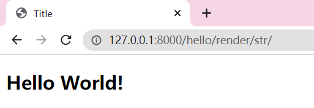
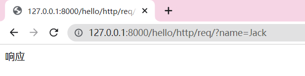

## 需求分析

### 功能性需求

- 登陆
- 注册
- 景点、门票展示
- 在线预订门票
- 后台管理
- 统计报表

### 非功能性需求

- 首页
- 界面
- 移动端
- 时间有限
- 便于维护、按模块开发

## 技术栈

- Django
- Vue
- MySQL
- Redis

## 版本迭代计划

*v1.0*:首页的基本功能，无需登录

*v1.1*:景点详情、评论、搜索

*v1.2*:用户的注册和登录功能

*v1.3*:提交订单、订单管理

*v1.4*:后台管理、报表统计

## 技术部分

### 初识 Django 框架

- Django 安装及项目搭建
- Django 项目开发基本流程
- Django 请求到响应
- 视图、类视图、快捷视图函数、内置视图重写
- Django 模板部分
  - 模板引擎的选择和配置
  - 模板语法(变量、标签)
  - 模板的继承与包含
  - 过滤器、自定义过滤器

https://docs.djangoproject.com/en/4.1/

开发步骤：

1. 选择合适版本
2. 安装及配置
3. 生成项目结构
4. 内容开发
5. 迭代、上线、维护

### 基础

- 掌握 Django 的安装
- 掌握 Django 项目的创建
- 了解 Django 项目的文件目录结构
- 了解 Django 项目开发服务器的启动

#### 开发流程

- 掌握开发服务器配置
- 掌握项目模块创建
- 理解项目开发流程，完成第一个页面

需要在 *settings.py* 配置 `ALLOWED_HOSTS` 允许访问的端口号

> python manage.py runserver PORT

<div align=left>
  
</div>

> python manage.py startapp MODULE

<div align=left>
  
</div>

完成第一个页面

1. *view.py* 中编写函数

   *hello/views.py*

   ```python
   from django.http import HttpResponse
   
   def hello_world(request):
       return HttpResponse('Hello World')
   ```

2. *urls.py* 中配置路由规则

   *DjangoLearning/urls.py*

   ```python
   urlpatterns = [
   	...
       path('hello/', hello_world)
   ]
   ```

<div align=left>
  
</div>


#### 从请求到响应

- 了解 URL 的设计及配置
- 掌握视图的定义及作用
- 掌握 URL 和视图的关系
- 了解视图响应的内容

URL设计：

正则表达式 && 指定参数类型

`path`(*route*,*view*, *kwargs=None***,** *name=None*)

------

`include`(*module*, *namespace=None*)

`include`(*pattern_list*)

`include`(*(pattern_list*, *app_namespace)*, *namespace=None*)

用于模块化开发

*hello/views.py*

```python
def hello_world(request):
    return HttpResponse('Hello World')


def hello_china(request):
    return HttpResponse('Hello China')
```

*hello/urls.py*

```python
urlpatterns = [
    path('world/', hello_world),
    path('china/', hello_china)
]
```

*DjangoLearning/urls.py*

```python
urlpatterns = [
    path('admin/', admin.site.urls),
    path('hello/', include('hello.urls'))
]
```

| /hello/world/                | /hello/china/                |
| ---------------------------- | ---------------------------- |
|  |  |

#### 在视图中处理业务逻辑

- 理解响应 HTML 内容
- 掌握如何获取 URL 参数
- 掌握如何获取 GET 参数

##### 响应 HTML 内容

*hello/views.py*

```python
def hello_html(request):
    html = """
    <html>
        <body>
            <h1 style="color:#f00">hello html</h1>
        </body>
    </html>
    """
    return HttpResponse(html)
```

*hello/urls.py*

```python
urlpatterns = [
    ...
    path('html/', hello_html)
]
```

| /hello/html/                |
| --------------------------- |
|  |

##### 获取 URL 参数

*hello/views.py*

```python
def article_list(request, month):
    return HttpResponse('article: {}'.format(month))
```

*hello/urls.py*

```python
urlpatterns = [
    ...
    path('article/<int:month>/', article_list)
]
```

| /hello/article/2/                   |
| ----------------------------------- |
|  |

**用正则表达式匹配**

*hello/views.py*

```python
def article_list(request, month):
    return HttpResponse('article: {}'.format(month))
```

*hello/urls.py*

```python
urlpatterns = [
    ...
    # path('article/<int:month>/', article_list)
    re_path(r'^article/(?P<month>0?[1-9]|1[012])/$', article_list)
]
```

| /hello/article/02/                  | /hello/article/12/                  |
| ----------------------------------- | ----------------------------------- |
|  |  |

##### 获取 GET 请求参数

*hello/views.py*

```python
def search(request):
    name = request.GET.get('name', '')
    print(name)
    return HttpResponse('查询成功')
```

*hello/urls.py*

```python
urlpatterns = [
    ...
    path('search/', search)
]
```

| hello/search/?name=China       |
| ------------------------------ |
|  |
|    |

#### 从文件中响应 HTML 内容

增加 index.html 文件

```html
<!DOCTYPE html>
<html lang="en">
    <head>
        <meta charset="UTF-8">
        <title>Title</title>
    </head>
    <body>
        <h2>Hello World!</h2>
    </body>
</html>
```

------

`render_to_string`(*template_name*, *context=None***,** *request=None***,** *using=None*)

- **template_name**：要使用的模板的全名或模板名称的序列
- context：要添加到模板上下文的值的字典，默认为空
- request：可选项 [`HttpRequest`](https://docs.djangoproject.com/zh-hans/4.1/ref/request-response/#django.http.HttpRequest) 在模板的渲染过程中可用。（dict）
- using：可选的模板引擎 [`NAME`](https://docs.djangoproject.com/zh-hans/4.1/ref/settings/#std-setting-TEMPLATES-NAME)。对模板的搜索将限于该引擎。（Jinja2）

*hello/views.py*

```python
def render_str(request):
    templ_name = 'index.html'
    html = render_to_string(template_name=templ_name)
    return HttpResponse(html)
```

*hello/urls.py*

```python
urlpatterns = [
    ...
    path('render/str/', render_str)
]
```

> DjangoLearning/settings.py 

| /hello/render/str/                 |
| ---------------------------------- |
|  |

`render`(*request*,*template_name*,*context=None*, *content_type=None*, *status=None***,** *using=None***)**

- **request**：用于生成此响应的请求对象
- **template_name**：要使用的模板的全名或模板名称的序列
- context：要添加到模板上下文的值的字典，默认为空
- content_type：用于结果文档的 MIME 类型。默认 `'text/html'` 
- status：响应的状态码默认为 `200`
- using：可选的模板引擎 [`NAME`](https://docs.djangoproject.com/zh-hans/4.1/ref/settings/#std-setting-TEMPLATES-NAME)

*hello/views.py*

```python
def render_html(request):
    return render(request, 'index.html')
```

*hello/urls.py*

```python
urlpatterns = [
    ...
    path('render/html/', render_html)
]
```

| /hello/render/html/                 |
| ----------------------------------- |
|  |

#### 请求响应对象

- 掌握请求到响应的流程
- 理解请求对象
- 理解响应对象

##### 请求对象

- 请求方式
- 请求头信息
- 请求传递参数

*hello/views.py*

```python
def http_request(request):
    print(request.method)

    print(request.META)
    print(request.headers)
    # print(request.headers['User-Agent'])

    name = request.GET.get('name', '')
    print(name)
    return HttpResponse('响应')
```

*hello/urls.py*

```python
urlpatterns = [
    ...
    path('http/req/', http_request)
]
```

| /hello/http/req/?name=Jack           |
| ------------------------------------ |
|  |
|  |

##### 响应对象 

- HttpResponseBase
  - **HttpResponse**
    - **JsonResponse**
    - HttpResponseNotFound
    - HttpResponseBadRequest
    - HttpResponseRedirectBase
      - **HttpResponseRedirect**
  - StreamingHttpResponse
    - FileResponse

*hello/views.py*

```python
def http_response(request):
    resp = HttpResponse('响应内容')
    return resp

def http_json_response(request):
    user_info = {
        'name': '张三',
        'age': 34
    }
    resp = JsonResponse(user_info)
    return resp

```

*hello/urls.py*

```python
urlpatterns = [
    ...
    path('http/resp/', http_response),
    path('http/jsonresp/', http_json_response)
]
```

| /hello/http/resp/                     | /hello/http/jsonresp/                      |
| ------------------------------------- | ------------------------------------------ |
|  |  |

常见的Content-Type：

| 类型             | 说明                     |
| ---------------- | ------------------------ |
| text/html        | 超文本标记语言文本(HTML) |
| text/plain       | 普通文本                 |
| text/xml         | XML文档                  |
| application/json | json数据类型             |
| image            | 图片或图形               |

#### 重定向

##### HttpResponseRedirect

- 方式一：

*hello/views.py*

```python
def article_detail(request, article_id):
    if article_id < 1000:
        return HttpResponseRedirect('/hello/404/')
    return HttpResponse('{}'.format(article_id))


def not_found(request):
    return HttpResponse('404')
```

*hello/urls.py*

```python
urlpatterns = [
    ...
    path('article/<int:article_id>/', article_detail),
    path('404/', not_found)
]
```

- 方式二

*hello/views.py*

```python
def article_detail(request, article_id):
    if article_id < 1000:
        return HttpResponseRedirect(reverse('not_found'))
    return HttpResponse('{}'.format(article_id))


def not_found(request):
    return HttpResponse('404')
```

*hello/urls.py*

```python
urlpatterns = [
    ...
    path('article/<int:article_id>/', article_detail),
    path('404/', not_found, name='not_found')
]
```

##### redirect

- 方式一：

*hello/views.py*

```python
def article_detail(request, article_id):
    if article_id < 1000:
        return redirect('/hello/404/')
    return HttpResponse('{}'.format(article_id))


def not_found(request):
    return HttpResponse('404')
```

*hello/urls.py*

```python
urlpatterns = [
    ...
    path('article/<int:article_id>/', article_detail),
    path('404/', not_found)
]
```

- 方式二

*hello/views.py*

```python
def article_detail(request, article_id):
    if article_id < 1000:
        return HttpResponseRedirect(reverse('not_found'))
    return HttpResponse('{}'.format(article_id))


def not_found(request):
    return HttpResponse('404')
```

*hello/urls.py*

```python
urlpatterns = [
    ...
    path('article/<int:article_id>/', article_detail),
    path('404/', not_found, name='not_found')
]
```

------

| /hello/article/1000/   --->   /hello/404/ |
| ----------------------------------------- |
|      |

#### 内置视图

#### 重写视图